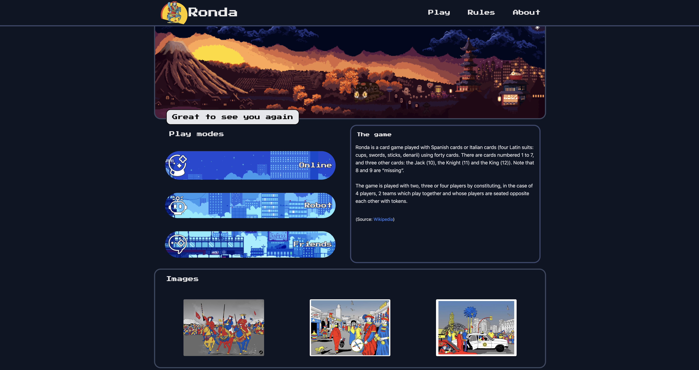
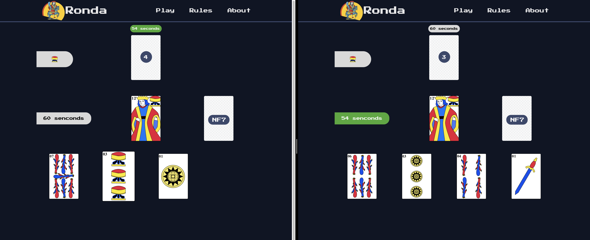
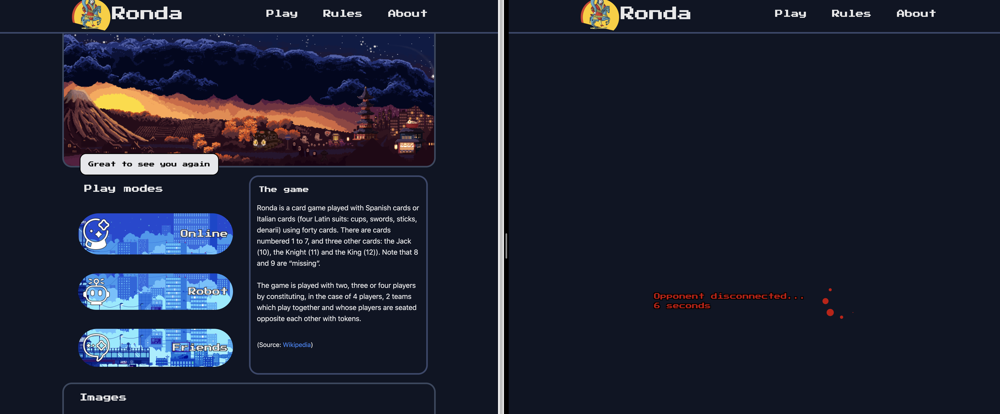

[](https://github.com/ozennou/Ronda-dev/actions/workflows/workflow.yml)
# **RONDA Dev Repository**
## Overview
- Ronda Dev is a repository of the code base backend of Moroccan ronda game with the following rules : 
```
-There are four types of cards : Sticks - Cups - Swords - Gold.
-Each type consists of 10 cards numbered from 1 to 7 and from10 to 12.
-You can play between two to four people.
-We start by taking four cards for each player and one card remains in the middle. The game consists of playing a card that is similar to the one in the middle (same type or same number) and placing it . If you do not have any card that meets these criteria, you must take an additional card and then another if necessary, until you obtain a card that is similar to one in the middle.
-If you play a card with the number 1, then the next player will not play. But he can only play if he, also, has a card with number 1, regardless of the type, in this case the next player will not play and so on.
-If you play a card with the number 2, then the next player will not play and will be required to take 2 more cards, unless he has ,also, a card with the number 2, in this case, he will be able to play but the next player will be obliged to take 4 more cards (2 + 2, the sum of the previous additional cards)
-If you play a card whose number is 7, then in this case you have the right to change the type of card as you wish.
-The winner of the game is the one who no longer has a card in their possession.
```

## **DevOps part**
- In the DevOps part I create a CI/CD pipelines using GitHub actions for building, testing and pushing the backend docker image to [DockerHub]() the game backend and also trigger other pipeline in the [Ronda-deploy](https://github.com/ozennou/Ronda-deploy) repository that deploy the backend in AKS cluster:


## **Backend part**
- In this part I work using django websockets to create a real time game, when a player want to start a game fistly get connected to the matchmaking websocket that use a queue to create a game between two players and redirect them to the new game websocket uri when the game logic started:

<br/>
<br/>
<br/>
<br/>
<br/>
<br/>
<br/>
<br/>
